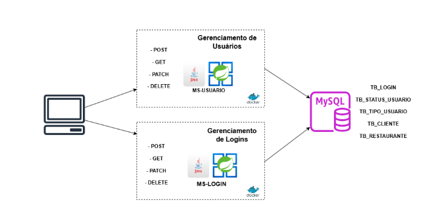

# Tech Challenge da instituição FIAP para o curso pós graduação em Arquitetura e Desenvolvimento Java

### Link da documentação do Tech Challenge 1 - https://docs.google.com/document/d/1NRsfSBYdT85sUO102jfotT-vGljYR9anmU2RUm7VltM/edit?usp=sharing
### Link da documentação do Tech Challenge 2 - https://docs.google.com/document/d/1NRsfSBYdT85sUO102jfotT-vGljYR9anmU2RUm7VltM/edit?usp=sharing

## Arquitetura de Microsserviços - Gerenciamento de Usuários e Logins

### 📌 Descrição da Arquitetura

Este projeto foi desenvolvido com base em três pilares arquiteturais:

- **Microsserviços**
- **Arquitetura Hexagonal (Ports and Adapters)**
- **API First**

A aplicação está dividida em dois microsserviços independentes:

#### 🧩 Microsserviços

#### 🔹 ms-login
Responsável pelas operações de **cadastro**, **atualização**, **exclusão**, **consulta** e **autenticação** de usuários.

#### 🔹 ms-restaurante
Responsável pelas operações de **cadastro**, **atualização**, **exclusão**, **consulta** e **autenticação** de restaurantes, tipos de cozinha e itens do cardápio.

Ambos os microsserviços foram implementados com a linguagem **Java 17**, utilizando o framework **Spring Boot** para desenvolvimento, injeção de dependência e exposição de endpoints REST.

---

### ⚙️ Tecnologias Utilizadas

- **Linguagem e Frameworks**: Java 17, Spring Boot, Spring Data JPA
- **Gerenciamento de Dependências**: Maven e Gradle
- **Banco de Dados**: 
  - MySQL 8.3 (executado em containers Docker)
  - Postgres 
  - H2 (utilizado exclusivamente para testes locais)
- **Documentação e Contratos de API**: OpenAPI/Swagger com geração automática de código (API First)
- **Mapeamento de Objetos**: MapStruct (conversão entre entidades, domínios e DTOs)
- **Redução de Código Boilerplate**: Projeto Lombok
- **Controle de Versão**: Git
- **Conteinerização**: Docker

---

### 🧪 Estratégia de Testes

A qualidade do software é garantida por testes em diferentes níveis:

- **Testes Unitários**: com JUnit 5 e Mockito para validar unidades isoladas de código.
- **Testes de API**: testes manuais realizados via coleções do Postman, assegurando a conformidade com os contratos definidos via OpenAPI.

---

### 📊 Diagrama da Arquitetura



---

### Execução

- Baixar scripts, clonar projetos e buildar containers:
  
```
git clone git@github.com:FIAP-Pos-Arq-e-Dev-Java/.github.git WeFood
cd WeFood
chmod +x setup.sh
./setup.sh
```  
