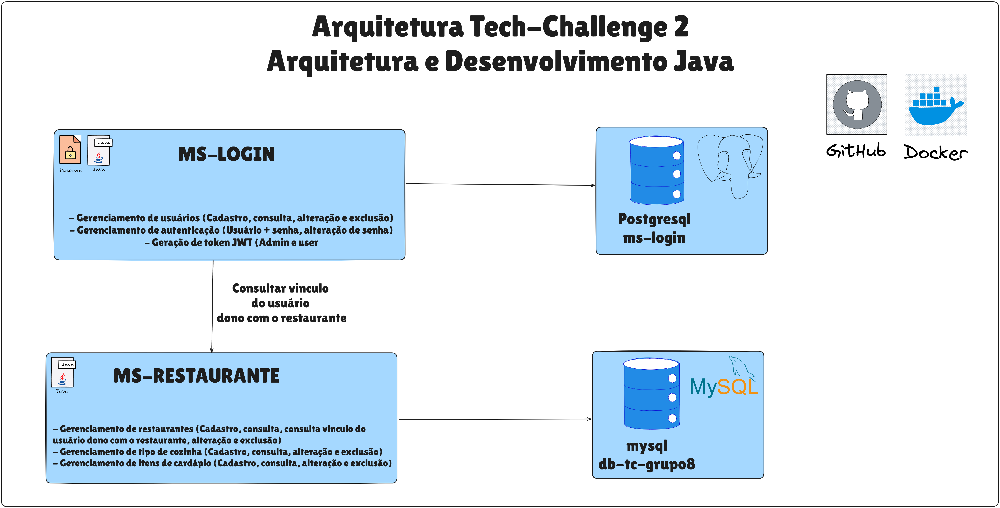

# Tech Challenge da instituição FIAP para o curso pós-graduação em Arquitetura e Desenvolvimento Java

### 📄 [Documentação Oficial do Desafio](https://docs.google.com/document/d/1-tYWdBCnAFoLgNF_DnMFL9FFcWXoOvRZiMLU4fICVM4)
### 🎥 Vídeo - [URL](https://exemplo.com) 

## Arquitetura de Microsserviços - Gerenciamento de Usuários e Logins

### 📌 Descrição da Arquitetura

Este projeto foi desenvolvido com base em três pilares arquiteturais:

- **Microsserviços**
- **Arquitetura Hexagonal (Ports and Adapters)**
- **API First**

A aplicação está dividida em dois microsserviços independentes:

### 🧩 Microsserviços

#### 🔹 ms-login
Responsável pelas operações de **cadastro**, **atualização**, **exclusão**, **consulta** e **autenticação** de usuários.

#### 🔹 ms-restaurante
Responsável pelas operações de **cadastro**, **atualização**, **exclusão**, **consulta** e **autenticação** de restaurantes, tipos de cozinha e itens do cardápio.

Ambos os microsserviços foram implementados com a linguagem **Java 17**, utilizando o framework **Spring Boot** para desenvolvimento, injeção de dependência e exposição de endpoints REST.

---

### ⚙️ Tecnologias Utilizadas

- **Linguagem e Frameworks**: Java 21, Spring Boot, Spring Data JPA  
- **Gerenciamento de Dependências**: Maven e Gradle  
- **Banco de Dados**:  
  - MySQL 8.3 (Docker)  
  - PostgreSQL (Docker)  
  - H2 (para testes locais)  
- **Documentação de API**: OpenAPI/Swagger (API First)  
- **MapStruct**: Mapeamento entre entidades e DTOs  
- **Lombok**: Redução de boilerplate  
- **Git**: Controle de versão  
- **Docker**: Conteinerização  

---

### 🧪 Estratégia de Testes

- **Testes Unitários**: JUnit 5 e Mockito  
- **Testes de API**: via Postman (coleções manuais ou automatizadas)

---

### 📊 Diagrama da Arquitetura



---

## 🐳 Execução do Projeto com Docker Compose

Este projeto utiliza Docker Compose para orquestrar dois microsserviços:

- `ms-login` (Spring Boot + PostgreSQL)  
- `ms-restaurante` (Spring Boot + MySQL)

---

### ✅ Pré-requisitos

- [Docker](https://www.docker.com/products/docker-desktop)  
- [Docker Compose](https://docs.docker.com/compose/)  
- [Postman](https://www.postman.com/downloads/) – para testar as APIs  
- (Opcional) [DBeaver](https://dbeaver.io/download/) – para conectar e visualizar os bancos de dados  

---

### 🚀 Como executar

1. Clone este repositório e entre na raiz do projeto.
2. Execute o comando:

```bash
docker-compose up --build
